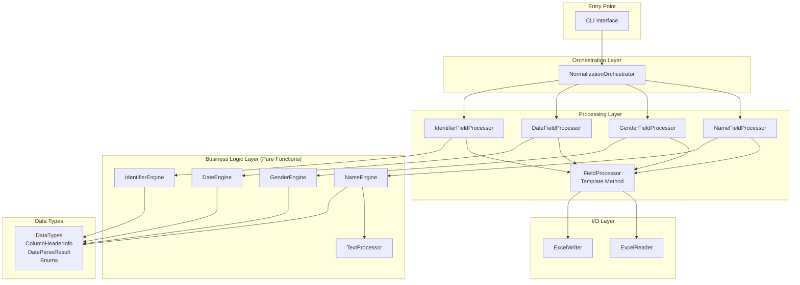

# Design Document: Excel Data Normalization Python

## Overview

This document defines the architecture for a Python-based Excel data normalization system that replicates the exact behavior of a legacy VBA implementation. The system processes Excel workbooks containing person records (residents, staff, etc.) from various sources, normalizing inconsistent data into a standardized format.

### Core Design Principle

The Python system SHALL replicate the exact behavior of the legacy VBA implementation. This is not a reimagining or improvement—it is a faithful port that preserves all business logic, validation rules, and processing patterns from the VBA codebase.

### Key Characteristics

- **Rule-based and deterministic**: No machine learning or probabilistic algorithms
- **In-place modification**: Works directly with Excel files (no JSON conversion layer)
- **Hardcoded logic**: Business rules embedded in code (no configuration files)
- **Array-based operations**: Processes columns as arrays, not cell-by-cell
- **Visual feedback**: Highlights changed cells in pink RGB(255, 199, 206)
- **Hebrew status messages**: Uses exact same status text as VBA system

### Processing Scope

The system normalizes four categories of data:
1. **Names**: First name, last name, father's name (text normalization, language detection, father name pattern removal)
2. **Gender**: Various representations normalized to 1 (male) or 2 (female)
3. **Dates**: Birth date and entry date (split columns, format detection, validation)
4. **Identifiers**: Israeli ID (with checksum validation) and passport numbers

## Architecture

### Architectural Principles

The VBA system has a clean architecture that we preserve and enhance in Python:

1. **Strict Separation of Concerns**: Excel I/O operations are completely isolated from business logic
2. **Pure Functions**: Engine classes contain pure business logic with zero Excel dependencies
3. **Data Structure Abstraction**: FieldProcessors operate on plain Python data structures (lists, dicts, dataclasses), never on openpyxl Worksheet objects
4. **Template Method Pattern**: FieldProcessor provides a template for processing different field types
5. **Array-Based Operations**: Data is read as arrays, processed in memory, and written back as arrays
6. **Type Safety**: Python type hints throughout for clarity and IDE support

### Data Flow Architecture

The system follows a strict data flow that isolates Excel I/O from business logic:

```
Excel File → ExcelReader → Python Data Structures → FieldProcessors/Engines → Normalized Results → ExcelWriter → Excel File
```

**Key Principle**: Only ExcelReader and ExcelWriter interact with openpyxl. All other components work with plain Python types.

### System Architecture Diagram



### Layer Responsibilities

**Entry Point Layer**
- CLI interface for running the normalization
- Argument parsing and validation
- Error handling and user feedback

**Orchestration Layer**
- Coordinates processing across all worksheets
- Manages workbook lifecycle (load, process, save)
- Controls processing order (names → gender → dates → identifiers)
- Tracks corrected column positions

**Processing Layer**
- FieldProcessor: Abstract base class with template method pattern
- Specialized processors for each field type
- Handles header detection, column insertion, array processing
- Delegates business logic to engines

**I/O Layer**
- ExcelReader: Reads data from Excel (FindHeader, ReadColumnArray, ReadCellValue)
- ExcelWriter: Writes data to Excel (PrepareOutputColumn, WriteColumnArray, WriteCellValue, FormatCell)
- Encapsulates all openpyxl interactions

**Business Logic Layer**
- Pure functions with no Excel dependencies
- NameEngine: Name normalization logic
- DateEngine: Date parsing and validation logic
- GenderEngine: Gender normalization logic
- IdentifierEngine: ID/passport validation logic
- TextProcessor: Text manipulation utilities

**Data Types Layer**
- Type definitions using dataclasses
- Enums for constants
- Shared data structures

## Components and Interfaces

### 1. NormalizationOrchestrator

**Responsibility**: Coordinates processing across all worksheets in a workbook.

**Key Methods**:
```python
def normalize_workbook(self, file_path: str) -> None:
    """Process all worksheets in the workbook."""
    
def process_worksheet(self, worksheet: Worksheet) -> None:
    """Process a single worksheet in order: names, gender, dates, identifiers."""
    
def get_corrected_column(self, sheet_name: str, field_key: str) -> Optional[int]:
    """Retrieve the column number for a corrected field."""
```

**Dependencies**: FieldProcessor subclasses, ExcelReader, ExcelWriter

**VBA Equivalent**: `NormalizeAllWorksheets` subroutine

### 2. FieldProcessor (Abstract Base Class)

**Responsibility**: Template method pattern for processing fields.

**Key Methods**:
```python
@abstractmethod
def find_headers(self, worksheet: Worksheet) -> bool:
    """Find column headers for this field type."""
    
@abstractmethod
def prepare_output_columns(self, worksheet: Worksheet) -> None:
    """Insert corrected columns after original columns."""
    
@abstractmethod
def process_data(self, worksheet: Worksheet) -> None:
    """Read, normalize, and write data."""
    
def process_field(self, worksheet: Worksheet) -> None:
    """Template method: find headers, prepare columns, process data."""
```

**Dependencies**: ExcelReader, ExcelWriter, Engine classes

**VBA Equivalent**: Pattern used across `ProcessNames`, `ProcessGender`, `ProcessDateField`, `ProcessIdentifiers`

### 3. NameFieldProcessor

**Responsibility**: Process first name, last name, and father's name fields.

**Key Methods**:
```python
def find_headers(self, worksheet: Worksheet) -> bool:
    """Find שם פרטי, שם משפחה, שם האב headers."""
    
def prepare_output_columns(self, worksheet: Worksheet) -> None:
    """Insert corrected columns with ' - מתוקן' suffix."""
    
def process_data(self, worksheet: Worksheet) -> None:
    """Normalize names using NameEngine."""
    
def detect_father_name_pattern(self, father_names: List[str], last_names: List[str]) -> FatherNamePattern:
    """Detect if last name should be removed from father name."""
```

**Dependencies**: NameEngine, TextProcessor, ExcelReader, ExcelWriter

**VBA Equivalent**: `ProcessNames`, `ProcessFatherName`, `DetectFatherNamePattern`

### 4. GenderFieldProcessor

**Responsibility**: Process gender field with specific header format.

**Key Methods**:
```python
def find_headers(self, worksheet: Worksheet) -> bool:
    """Find 'מין\\n1=זכר\\n2+נקבה' header (with line breaks)."""
    
def prepare_output_columns(self, worksheet: Worksheet) -> None:
    """Insert corrected column with 'מין - מתוקן' header."""
    
def process_data(self, worksheet: Worksheet) -> None:
    """Normalize gender values using GenderEngine."""
```

**Dependencies**: GenderEngine, ExcelReader, ExcelWriter

**VBA Equivalent**: `ProcessGender`, `NormalizeGenderValue`

### 5. DateFieldProcessor

**Responsibility**: Process birth date and entry date fields with split columns.

**Key Methods**:
```python
def find_headers(self, worksheet: Worksheet) -> bool:
    """Find תאריך לידה and תאריך כניסה למוסד headers with sub-headers."""
    
def prepare_output_columns(self, worksheet: Worksheet) -> None:
    """Insert 4 corrected columns: year, month, day, status."""
    
def process_data(self, worksheet: Worksheet) -> None:
    """Parse and validate dates using DateEngine."""
    
def detect_date_format_pattern(self, date_values: List[Any]) -> DateFormatPattern:
    """Detect DDMM vs MMDD pattern for ambiguous dates."""
```

**Dependencies**: DateEngine, ExcelReader, ExcelWriter

**VBA Equivalent**: `ProcessDateField`, `DetectDominantPattern`, `ParseDateValue`, `ValidateBusinessRules`

### 6. IdentifierFieldProcessor

**Responsibility**: Process Israeli ID and passport fields together.

**Key Methods**:
```python
def find_headers(self, worksheet: Worksheet) -> bool:
    """Find מספר זהות and מספר דרכון headers."""
    
def prepare_output_columns(self, worksheet: Worksheet) -> None:
    """Insert 3 corrected columns: ID, passport, status."""
    
def process_data(self, worksheet: Worksheet) -> None:
    """Validate IDs and clean passports using IdentifierEngine."""
```

**Dependencies**: IdentifierEngine, ExcelReader, ExcelWriter

**VBA Equivalent**: `ProcessIdentifiers`, `ProcessIDValue`, `ValidateChecksum`, `CleanPassportValue`

### 7. ExcelReader

**Responsibility**: Read data from Excel worksheets.

**Key Methods**:
```python
def find_header(self, worksheet: Worksheet, search_terms: List[str], 
                normalize_linebreaks: bool = False) -> Optional[ColumnHeaderInfo]:
    """Find column by exact text matching (xlPart equivalent)."""
    
def read_column_array(self, worksheet: Worksheet, col: int, 
                      start_row: int, end_row: int) -> List[Any]:
    """Read column data as array."""
    
def read_cell_value(self, worksheet: Worksheet, row: int, col: int) -> Any:
    """Read single cell value."""
    
def get_last_row(self, worksheet: Worksheet, col: int) -> int:
    """Find last non-empty row in column."""
```

**Dependencies**: openpyxl

**VBA Equivalent**: `FindHeader`, `ReadColumnArray`, `ReadCellValue` patterns

### 8. ExcelWriter

**Responsibility**: Write data to Excel worksheets.

**Key Methods**:
```python
def prepare_output_column(self, worksheet: Worksheet, after_col: int, 
                          header_text: str, header_row: int) -> int:
    """Insert new column and set header."""
    
def write_column_array(self, worksheet: Worksheet, col: int, start_row: int, 
                       values: List[Any]) -> None:
    """Write array to column."""
    
def write_cell_value(self, worksheet: Worksheet, row: int, col: int, 
                     value: Any) -> None:
    """Write single cell value."""
    
def format_cell(self, worksheet: Worksheet, row: int, col: int, 
                bg_color: Optional[str] = None, bold: bool = False, 
                number_format: Optional[str] = None) -> None:
    """Apply formatting to cell."""
    
def highlight_changed_cells(self, worksheet: Worksheet, col: int, 
                            start_row: int, original_values: List[Any], 
                            corrected_values: List[Any]) -> None:
    """Apply pink highlight to cells where values differ."""
```

**Dependencies**: openpyxl

**VBA Equivalent**: `PrepareOutputColumn`, `WriteColumnArray`, `WriteCellValue`, `FormatCell` patterns

### 9. NameEngine

**Responsibility**: Pure business logic for name normalization.

**Key Methods**:
```python
def normalize_name(self, name: str) -> str:
    """Apply text normalization to name."""
    
def remove_last_name_from_father(self, father_name: str, last_name: str, 
                                  pattern: FatherNamePattern) -> str:
    """Remove last name from father name based on detected pattern."""
```

**Dependencies**: TextProcessor

**VBA Equivalent**: `CleanName` logic applied to names

### 10. TextProcessor

**Responsibility**: Pure text manipulation utilities.

**Key Methods**:
```python
def clean_text(self, text: str) -> str:
    """Trim, remove diacritics, keep dominant language, fix spacing."""
    
def detect_language_dominance(self, text: str) -> Language:
    """Count Hebrew vs English letters to determine dominant language."""
    
def remove_diacritics(self, text: str) -> str:
    """Remove accent marks using character code mappings."""
    
def fix_hebrew_final_letters(self, text: str) -> str:
    """Add space after Hebrew final letters if needed."""
    
def collapse_spaces(self, text: str) -> str:
    """Replace multiple spaces with single space."""
```

**Dependencies**: None (pure functions)

**VBA Equivalent**: `CleanName`, `RemoveDiacritics` subroutines

### 11. DateEngine

**Responsibility**: Pure business logic for date parsing and validation.

**Key Methods**:
```python
def parse_date(self, year_val: Any, month_val: Any, day_val: Any, 
               main_val: Any, pattern: DateFormatPattern) -> DateParseResult:
    """Parse date from split columns or main value."""
    
def parse_from_split_columns(self, year_val: Any, month_val: Any, 
                             day_val: Any) -> DateParseResult:
    """Parse date from split year, month, day columns."""
    
def parse_from_main_value(self, main_val: Any, 
                          pattern: DateFormatPattern) -> DateParseResult:
    """Parse date from main column value."""
    
def validate_business_rules(self, result: DateParseResult, 
                            field_type: DateFieldType) -> DateParseResult:
    """Apply business rule validation (age, future dates, etc.)."""
    
def expand_two_digit_year(self, year: int) -> int:
    """Expand 2-digit year to 4-digit year."""
```

**Dependencies**: None (pure functions)

**VBA Equivalent**: `ParseFromSplitColumns`, `ParseDateValue`, `ValidateBusinessRules`, `ExpandTwoDigitYear`

### 12. GenderEngine

**Responsibility**: Pure business logic for gender normalization.

**Key Methods**:
```python
def normalize_gender(self, value: Any) -> int:
    """Normalize gender value to 1 (male) or 2 (female)."""
```

**Dependencies**: None (pure functions)

**VBA Equivalent**: `NormalizeGenderValue`

### 13. IdentifierEngine

**Responsibility**: Pure business logic for ID/passport validation.

**Key Methods**:
```python
def normalize_identifiers(self, id_value: Any, passport_value: Any) -> IdentifierResult:
    """Process ID and passport values together."""
    
def validate_israeli_id(self, id_digits: str) -> bool:
    """Validate Israeli ID checksum."""
    
def clean_passport(self, passport: str) -> str:
    """Remove invalid characters from passport."""
    
def classify_id_value(self, id_value: Any) -> Tuple[str, bool]:
    """Determine if ID value is valid Israeli ID or should be moved to passport."""
```

**Dependencies**: None (pure functions)

**VBA Equivalent**: `ProcessIDValue`, `ValidateChecksum`, `CleanPassportValue`, `NormalizeIdentifiers`

## Data Models

### ColumnHeaderInfo

```python
@dataclass
class ColumnHeaderInfo:
    """Information about a found column header."""
    col: int              # Column number (1-based)
    header_row: int       # Row number where header was found
    last_row: int         # Last row with data in this column
    header_text: str      # The actual header text found
```

**VBA Equivalent**: Returned as tuple from `FindHeader`

### DateParseResult

```python
@dataclass
class DateParseResult:
    """Result of date parsing operation."""
    year: Optional[int]
    month: Optional[int]
    day: Optional[int]
    is_valid: bool
    status_text: str      # Hebrew status message
```

**VBA Equivalent**: Returned as tuple from `ParseDateValue`

### IdentifierResult

```python
@dataclass
class IdentifierResult:
    """Result of identifier processing."""
    corrected_id: str
    corrected_passport: str
    status_text: str      # Hebrew status message
```

**VBA Equivalent**: Returned as tuple from `NormalizeIdentifiers`

### Enums

```python
class Language(Enum):
    """Language dominance in text."""
    HEBREW = "hebrew"
    ENGLISH = "english"
    MIXED = "mixed"

class FatherNamePattern(Enum):
    """Pattern for removing last name from father name."""
    NONE = "none"
    REMOVE_FIRST = "remove_first"
    REMOVE_LAST = "remove_last"

class DateFormatPattern(Enum):
    """Date format pattern for ambiguous dates."""
    DDMM = "ddmm"
    MMDD = "mmdd"

class DateFieldType(Enum):
    """Type of date field being processed."""
    BIRTH_DATE = "birth_date"
    ENTRY_DATE = "entry_date"

class FieldKey(Enum):
    """Keys for tracking corrected columns."""
    SHEM_PRATI = "ShemPrati"
    SHEM_MISHPAHA = "ShemMishpaha"
    SHEM_HAAV = "ShemHaAv"
    MIN = "Min"
    SHNAT_LIDA = "ShnatLida"
    HODESH_LIDA = "HodeshLida"
    YOM_LIDA = "YomLida"
    SHNAT_KNISA = "shnatknisa"
    HODESH_KNISA = "Hodeshknisa"
    YOM_KNISA = "YomKnisa"
    MISPAR_ZEHUT = "MisparZehut"
    DARKON = "Darkon"
```

**VBA Equivalent**: Constants and patterns used throughout VBA code

## Technology Stack

### Core Dependencies

- **Python 3.9+**: Modern Python with type hints support
- **openpyxl 3.1+**: Excel file manipulation (read/write .xlsx files)
- **pytest 7.0+**: Testing framework
- **pytest-cov**: Code coverage reporting

### Development Dependencies

- **black**: Code formatting
- **mypy**: Static type checking
- **flake8**: Linting
- **hypothesis**: Property-based testing library

### Why openpyxl?

openpyxl is chosen because:
1. Pure Python (no external dependencies like COM)
2. Cross-platform (works on Windows, Mac, Linux)
3. Supports .xlsx format (modern Excel)
4. Provides cell-level formatting control
5. Supports column insertion
6. Widely used and well-maintained

### Project Structure

```
excel-data-normalization/
├── src/
│   └── excel_normalization/
│       ├── __init__.py
│       ├── cli.py                    # Entry point
│       ├── orchestrator.py           # NormalizationOrchestrator
│       ├── io_layer/
│       │   ├── __init__.py
│       │   ├── excel_reader.py       # ExcelReader
│       │   └── excel_writer.py       # ExcelWriter
│       ├── processing/
│       │   ├── __init__.py
│       │   ├── field_processor.py    # FieldProcessor base class
│       │   ├── name_processor.py     # NameFieldProcessor
│       │   ├── gender_processor.py   # GenderFieldProcessor
│       │   ├── date_processor.py     # DateFieldProcessor
│       │   └── identifier_processor.py  # IdentifierFieldProcessor
│       ├── engines/
│       │   ├── __init__.py
│       │   ├── name_engine.py        # NameEngine
│       │   ├── text_processor.py     # TextProcessor
│       │   ├── date_engine.py        # DateEngine
│       │   ├── gender_engine.py      # GenderEngine
│       │   └── identifier_engine.py  # IdentifierEngine
│       └── data_types.py             # DataTypes, enums
├── tests/
│   ├── __init__.py
│   ├── unit/
│   │   ├── test_name_engine.py
│   │   ├── test_text_processor.py
│   │   ├── test_date_engine.py
│   │   ├── test_gender_engine.py
│   │   ├── test_identifier_engine.py
│   │   ├── test_excel_reader.py
│   │   └── test_excel_writer.py
│   ├── integration/
│   │   └── test_orchestrator.py
│   └── fixtures/
│       └── sample_workbooks/
├── pyproject.toml
├── setup.py
├── README.md
└── requirements.txt
```

## Error Handling

### Error Handling Strategy

The system follows a defensive programming approach with clear error boundaries:

1. **File-Level Errors**: Fatal errors that prevent processing
   - File not found
   - File not readable (permissions, corruption)
   - File locked by another process
   - Invalid Excel format

2. **Worksheet-Level Errors**: Log and skip worksheet, continue with others
   - Worksheet structure unexpected
   - Header detection failures
   - Column insertion failures

3. **Row-Level Errors**: Log and continue processing other rows
   - Invalid data values
   - Parsing failures
   - Validation failures

4. **Cell-Level Errors**: Set status text, continue processing
   - Date parsing errors → status text in Hebrew
   - ID validation errors → status text in Hebrew
   - These are expected and handled gracefully

### Error Handling Patterns

**File Operations**:
```python
try:
    workbook = openpyxl.load_workbook(file_path)
except FileNotFoundError:
    logger.error(f"File not found: {file_path}")
    raise
except PermissionError:
    logger.error(f"Permission denied: {file_path}")
    raise
except Exception as e:
    logger.error(f"Failed to load workbook: {e}")
    raise
```

**Worksheet Processing**:
```python
for worksheet in workbook.worksheets:
    try:
        self.process_worksheet(worksheet)
    except Exception as e:
        logger.error(f"Failed to process worksheet {worksheet.title}: {e}")
        # Continue with next worksheet
        continue
```

**Data Processing**:
```python
# Cell-level errors are captured in status text, not exceptions
result = date_engine.parse_date(year, month, day, main_val, pattern)
if not result.is_valid:
    # Status text contains Hebrew error message
    # This is expected behavior, not an exception
    pass
```

### Logging Strategy

**Log Levels**:
- **ERROR**: File/worksheet failures that prevent processing
- **WARNING**: Unexpected conditions that don't prevent processing
- **INFO**: Processing milestones (worksheet start/complete, summary stats)
- **DEBUG**: Detailed processing information (header detection, pattern detection)

**Log Format**:
```
%(asctime)s - %(name)s - %(levelname)s - %(message)s
```

**Log Output**:
- Console: INFO and above
- File: DEBUG and above
- File location: `{output_dir}/normalization_{timestamp}.log`

**VBA Equivalent**: VBA system has minimal error handling; Python system improves on this while maintaining behavioral equivalence for valid inputs.


## Correctness Properties

*A property is a characteristic or behavior that should hold true across all valid executions of a system—essentially, a formal statement about what the system should do. Properties serve as the bridge between human-readable specifications and machine-verifiable correctness guarantees.*

### Property Reflection

After analyzing all acceptance criteria, I identified the following redundancies to eliminate:

1. **Text normalization properties (3.1, 3.4, 3.5, 3.6, 3.7)** can be combined into a single comprehensive text normalization round-trip property
2. **Passport character preservation properties (17.1-17.5)** can be combined into a single property about valid character preservation
3. **Gender normalization properties (7.6, 7.7)** can be combined into a single property covering all cases
4. **Date validation properties (10.4, 10.5, 10.6)** can be combined into a single date validity property
5. **ID padding and checksum properties (16.1, 16.4)** are related but test different aspects, so both are kept
6. **Highlighting properties (4.7, 13.3, 13.4)** can be combined into a single property about formatting based on value changes

The following properties provide unique validation value and are retained:

### Property 1: Original Data Preservation

*For any* workbook processed by the system, all data in original columns SHALL remain unchanged after processing.

**Validates: Requirements 1.6**

### Property 2: Header Variant Recognition

*For any* supported header variant (e.g., "שם פרטי" or "first name"), the system SHALL successfully locate the column when that header is present.

**Validates: Requirements 2.2**

### Property 3: Text Normalization Consistency

*For any* text value, applying text normalization SHALL produce a result that:
- Has no leading or trailing whitespace
- Has no diacritics
- Contains only letters of the dominant language (plus valid separators)
- Has single spaces between words (no consecutive spaces)
- Has proper spacing after Hebrew final letters when processing Hebrew text

**Validates: Requirements 3.1, 3.3, 3.4, 3.5, 3.6, 3.7**

### Property 4: Corrected Column Header Format

*For any* original column header that is processed, the corrected column header SHALL be the original header text with " - מתוקן" appended.

**Validates: Requirements 4.4**

### Property 5: Change Highlighting

*For any* cell where the corrected value differs from the original value, the system SHALL apply pink highlight (RGB 255, 199, 206) to the corrected cell.

**Validates: Requirements 4.7**

### Property 6: Father Name Last Name Removal

*For any* father name that contains the last name, when a removal pattern (RemoveFirst or RemoveLast) is detected, the system SHALL remove the last name substring from the father name.

**Validates: Requirements 6.5**

### Property 7: Line Break Normalization in Headers

*For any* line break variant (vbCrLf, vbCr, vbLf, \r\n, \r, \n), the gender header matching SHALL treat all variants as equivalent.

**Validates: Requirements 7.2**

### Property 8: Gender Female Pattern Recognition

*For any* gender value containing "2", "female", "נ", "אישה", or "בת" (case-insensitive), the normalized value SHALL be 2 (female).

**Validates: Requirements 7.6**

### Property 9: Gender Default to Male

*For any* gender value that does not match female patterns (including empty values), the normalized value SHALL be 1 (male).

**Validates: Requirements 7.7**

### Property 10: Two-Digit Year Expansion

*For any* two-digit year value, the system SHALL expand it to a four-digit year using the algorithm: if year <= current_year % 100, then 2000 + year, else 1900 + year.

**Validates: Requirements 10.3**

### Property 11: Date Component Range Validation

*For any* date with day outside 1-31 or month outside 1-12, the system SHALL mark the date as invalid and set appropriate status text.

**Validates: Requirements 10.4, 10.5**

### Property 12: Date Existence Validation

*For any* date components (year, month, day), the system SHALL validate that the date actually exists (e.g., February 30 is invalid) and set status text when invalid.

**Validates: Requirements 10.6, 10.7**

### Property 13: Eight-Digit Date Parsing

*For any* 8-digit numeric string, the system SHALL parse it as DDMMYYYY format.

**Validates: Requirements 11.5**

### Property 14: Six-Digit Date Parsing

*For any* 6-digit numeric string, the system SHALL parse it as DDMMYY format with two-digit year expansion.

**Validates: Requirements 11.6**

### Property 15: Four-Digit Date Parsing

*For any* 4-digit numeric string, the system SHALL parse it as DMYY format with two-digit year expansion.

**Validates: Requirements 11.7**

### Property 16: Separated Date Parsing

*For any* date string containing "/" or "." separators, the system SHALL parse it using the detected dominant pattern (DDMM or MMDD).

**Validates: Requirements 11.8**

### Property 17: Pre-1900 Date Rejection

*For any* date with year less than 1900, the system SHALL set status text to "שנה לפני 1900" and mark the date as invalid.

**Validates: Requirements 12.3**

### Property 18: Future Date Rejection

*For any* date in the future, the system SHALL set status text to "תאריך לידה עתידי" or "תאריך כניסה עתידי" (depending on field type) and mark the date as invalid.

**Validates: Requirements 12.4**

### Property 19: Age Over 100 Warning

*For any* birth date where the calculated age exceeds 100 years, the system SHALL set status text to "גיל מעל 100 (X שנים)" but keep the date as valid.

**Validates: Requirements 12.5**

### Property 20: Date Status Formatting

*For any* date status cell with non-empty status text:
- If status contains "גיל מעל", apply yellow background (RGB 255, 230, 150) and bold font
- Otherwise, apply pink background (RGB 255, 200, 200) and bold font

**Validates: Requirements 13.3, 13.4**

### Property 21: ID Non-Digit Character Rejection

*For any* ID value containing characters that are NOT digits or dash characters, the system SHALL move the value to the passport field and set appropriate status.

**Validates: Requirements 15.2**

### Property 22: Dash Variant Acceptance

*For any* dash Unicode variant (hyphen, non-breaking hyphen, figure dash, en-dash, em-dash, horizontal bar, minus sign), the system SHALL accept it as a valid separator in ID values.

**Validates: Requirements 15.3**

### Property 23: Short ID Rejection

*For any* ID value with fewer than 4 digits (after removing dashes), the system SHALL move it to the passport field and set status to "ת.ז. לא תקינה + הועברה לדרכון".

**Validates: Requirements 15.6**

### Property 24: Long ID Rejection

*For any* ID value with more than 9 digits (after removing dashes), the system SHALL move it to the passport field and set status to "ת.ז. הועברה לדרכון".

**Validates: Requirements 15.7**

### Property 25: ID Zero Padding

*For any* ID with 4-9 digits, the system SHALL pad it to 9 digits with leading zeros before validation.

**Validates: Requirements 16.1**

### Property 26: Identical Digit ID Rejection

*For any* ID where all 9 digits are identical (e.g., "111111111"), the system SHALL mark it as invalid.

**Validates: Requirements 16.3**

### Property 27: Israeli ID Checksum Validation

*For any* 9-digit Israeli ID, the checksum validation SHALL follow the algorithm: multiply digits at odd positions (1,3,5,7,9) by 1 and even positions (2,4,6,8) by 2, subtract 9 from any result > 9, sum all results, and verify the sum is divisible by 10.

**Validates: Requirements 16.4**

### Property 28: Valid ID Status

*For any* Israeli ID with valid checksum and no passport, the system SHALL set status to "ת.ז. תקינה".

**Validates: Requirements 16.5**

### Property 29: Invalid ID Status

*For any* Israeli ID with invalid checksum and no passport, the system SHALL set status to "ת.ז. לא תקינה".

**Validates: Requirements 16.6**

### Property 30: ID with Passport Status Suffix

*For any* case where both ID and passport values are present, the system SHALL append " + דרכון הוזן" to the ID status text.

**Validates: Requirements 16.7**

### Property 31: Passport Character Preservation

*For any* passport value, the cleaned passport SHALL contain only:
- Digits (0-9)
- English letters (A-Z, a-z)
- Hebrew letters (Unicode 1488-1514)
- Dash characters (all variants)

All other characters SHALL be removed.

**Validates: Requirements 17.1, 17.2, 17.3, 17.4, 17.5**

## Testing Strategy

### Dual Testing Approach

The system requires both unit testing and property-based testing for comprehensive coverage:

**Unit Tests**: Verify specific examples, edge cases, and error conditions
- Specific header matching scenarios
- Father name pattern detection with known data
- Specific date parsing examples (8-digit, 6-digit, 4-digit formats)
- Specific gender normalization cases
- Specific ID validation cases (all zeros, "9999", etc.)
- Integration tests with sample Excel files
- Error handling scenarios

**Property-Based Tests**: Verify universal properties across all inputs
- Text normalization consistency across random inputs
- Date parsing round-trips (parse then format should preserve meaning)
- Israeli ID checksum validation with generated valid/invalid IDs
- Gender normalization across random input variations
- Passport character filtering across random strings
- Original data preservation across random workbooks

### Property-Based Testing Configuration

**Library**: Hypothesis (Python property-based testing library)

**Test Configuration**:
- Minimum 100 iterations per property test (due to randomization)
- Each property test references its design document property
- Tag format: `# Feature: excel-data-normalization-python, Property {number}: {property_text}`

**Example Property Test Structure**:
```python
from hypothesis import given, strategies as st

# Feature: excel-data-normalization-python, Property 27: Israeli ID Checksum Validation
@given(st.lists(st.integers(min_value=0, max_value=9), min_size=9, max_size=9))
def test_israeli_id_checksum_property(digits):
    """For any 9-digit Israeli ID, checksum validation follows the algorithm."""
    id_string = ''.join(map(str, digits))
    result = identifier_engine.validate_israeli_id(id_string)
    
    # Manually calculate expected checksum
    checksum = 0
    for i, digit in enumerate(digits):
        if i % 2 == 0:  # Odd position (1-indexed)
            checksum += digit
        else:  # Even position
            val = digit * 2
            checksum += val - 9 if val > 9 else val
    
    expected_valid = (checksum % 10 == 0)
    assert result == expected_valid
```

### Testing Coverage Goals

- **Unit Test Coverage**: Minimum 80% code coverage
- **Property Test Coverage**: All 31 correctness properties implemented as property-based tests
- **Integration Test Coverage**: End-to-end tests with sample workbooks covering:
  - All field types (names, gender, dates, identifiers)
  - All header variants
  - All date formats
  - All ID validation scenarios
  - Mixed Hebrew/English text
  - Edge cases (empty cells, invalid data, missing headers)

### VBA Comparison Testing

**Critical Requirement**: The system MUST produce functionally equivalent output to the VBA system.

**Comparison Test Strategy**:
1. Maintain a set of reference Excel files
2. Process each file with both VBA system and Python system
3. Compare outputs cell-by-cell:
   - Corrected values must match exactly
   - Status messages must match exactly
   - Cell formatting must match (pink highlights, yellow highlights)
   - Column positions must match

**Test Data Requirements**:
- Use anonymized/synthetic data (no real personal information)
- Cover all normalization scenarios
- Include edge cases and error conditions
- Represent real-world data quality issues

### Test Organization

```
tests/
├── unit/
│   ├── test_name_engine.py          # NameEngine pure logic tests
│   ├── test_text_processor.py       # TextProcessor pure logic tests
│   ├── test_date_engine.py          # DateEngine pure logic tests
│   ├── test_gender_engine.py        # GenderEngine pure logic tests
│   ├── test_identifier_engine.py    # IdentifierEngine pure logic tests
│   ├── test_excel_reader.py         # ExcelReader I/O tests
│   └── test_excel_writer.py         # ExcelWriter I/O tests
├── property/
│   ├── test_text_properties.py      # Properties 3, 7
│   ├── test_date_properties.py      # Properties 10-20
│   ├── test_gender_properties.py    # Properties 8, 9
│   └── test_identifier_properties.py # Properties 21-31
├── integration/
│   ├── test_orchestrator.py         # End-to-end processing tests
│   └── test_vba_comparison.py       # VBA output comparison tests
└── fixtures/
    └── sample_workbooks/             # Test Excel files
```

### Continuous Integration

**CI Pipeline Requirements**:
1. Run all unit tests on every commit
2. Run property-based tests with 100 iterations
3. Run integration tests with sample workbooks
4. Generate code coverage report
5. Run type checking with mypy
6. Run linting with flake8
7. Run formatting check with black

**Performance Benchmarks**:
- Track processing time for 10,000-row workbook
- Alert if processing time exceeds 60 seconds
- Monitor memory usage during processing
