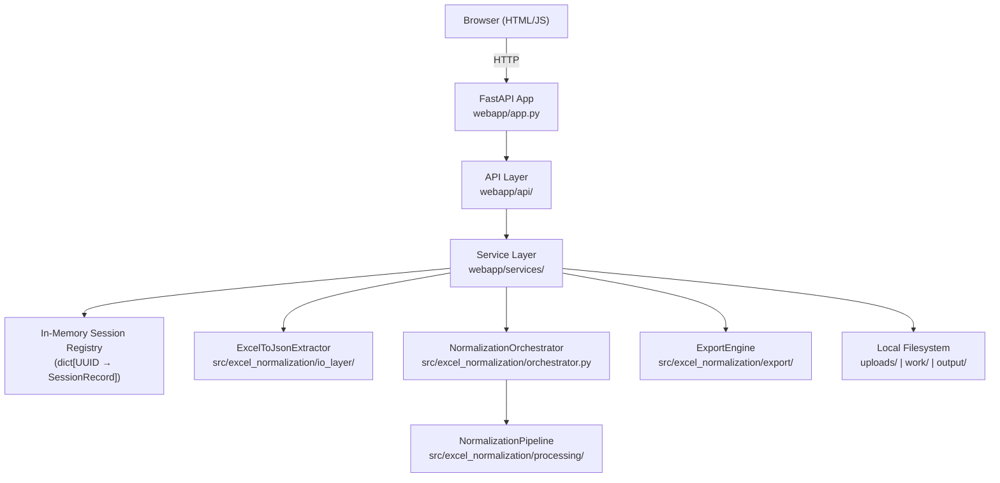

# Design Document: Excel Normalization Web App

## Overview

This document describes the technical design for a local FastAPI web application that wraps the existing Excel normalization pipeline. The web app lets non-technical users upload an Excel workbook, view its data in a browser grid, run the normalization pipeline with one click, manually edit cells, and download the corrected workbook — all offline, with no database and no authentication.

The existing normalization engines (`NameEngine`, `GenderEngine`, `DateEngine`, `IdentifierEngine`), the `NormalizationOrchestrator`, the `NormalizationPipeline`, and the IO layer (`ExcelToJsonExtractor`, `ExportEngine`) are preserved and reused without modification. The web app is a thin service layer on top of them.

---

## Architecture



**Request flow for a full normalization session:**

1. `POST /api/upload` → `UploadService` saves file to `uploads/` and `work/`, creates `SessionRecord`, returns `session_id` + sheet names.
2. `GET /api/workbook/{session_id}/summary` → `WorkbookService` reads `WorkbookDataset` from session, returns sheet metadata.
3. `GET /api/workbook/{session_id}/sheet/{sheet_name}` → `WorkbookService` returns rows from in-memory `SheetDataset`.
4. `POST /api/workbook/{session_id}/normalize` → `NormalizationService` calls `NormalizationOrchestrator.process_workbook_json` on the working copy, updates session dataset and status.
5. `PATCH /api/workbook/{session_id}/sheet/{sheet_name}/cell` → `EditService` mutates the in-memory `SheetDataset`.
6. `POST /api/workbook/{session_id}/export` → `ExportService` calls `ExportEngine.export_from_normalized_dataset`, streams the file back.

---

## Components and Interfaces

### webapp/app.py

The FastAPI application entry point. Responsibilities:
- Creates the `FastAPI` app instance.
- Mounts static files from `webapp/static/`.
- Registers all API routers from `webapp/api/`.
- Serves the single-page UI at `GET /`.
- Configures logging.
- Ensures `uploads/`, `work/`, and `output/` directories exist on startup.

```python
# webapp/app.py (sketch)
from fastapi import FastAPI
from fastapi.staticfiles import StaticFiles
from fastapi.templating import Jinja2Templates
from webapp.api import upload, workbook, normalize, edit, export

app = FastAPI(title="Excel Normalization Web App")
app.mount("/static", StaticFiles(directory="webapp/static"), name="static")

app.include_router(upload.router, prefix="/api")
app.include_router(workbook.router, prefix="/api")
app.include_router(normalize.router, prefix="/api")
app.include_router(edit.router, prefix="/api")
app.include_router(export.router, prefix="/api")
```

### webapp/api/ — API Layer

Thin FastAPI routers. Each router validates HTTP-level concerns (path params, request body shape) and delegates to the service layer. No business logic lives here.

| Module | Endpoints |
|---|---|
| `upload.py` | `POST /api/upload` |
| `workbook.py` | `GET /api/workbook/{session_id}/summary`, `GET /api/workbook/{session_id}/sheet/{sheet_name}` |
| `normalize.py` | `POST /api/workbook/{session_id}/normalize` |
| `edit.py` | `PATCH /api/workbook/{session_id}/sheet/{sheet_name}/cell` |
| `export.py` | `POST /api/workbook/{session_id}/export` |

### webapp/services/ — Service Layer

All business logic lives here. Services are plain Python classes (no FastAPI dependency), making them independently testable.

| Module | Class | Responsibility |
|---|---|---|
| `session_service.py` | `SessionService` | CRUD on the in-memory session registry |
| `upload_service.py` | `UploadService` | File validation, saving to `uploads/`/`work/`, session creation |
| `workbook_service.py` | `WorkbookService` | Extracting `WorkbookDataset` via `ExcelToJsonExtractor`, serving sheet data |
| `normalization_service.py` | `NormalizationService` | Invoking `NormalizationOrchestrator`, updating session state |
| `edit_service.py` | `EditService` | Mutating in-memory `SheetDataset` cells |
| `export_service.py` | `ExportService` | Writing output via `ExportEngine`, returning file path |

### webapp/models/ — Pydantic Models

Request/response schemas for the API layer.

| Model | Purpose |
|---|---|
| `UploadResponse` | `session_id`, `sheet_names` |
| `WorkbookSummary` | `session_id`, `sheets: list[SheetSummary]` |
| `SheetSummary` | `sheet_name`, `row_count`, `field_names` |
| `SheetDataResponse` | `sheet_name`, `field_names`, `rows: list[dict]` |
| `NormalizeResponse` | `session_id`, `status`, `sheets_processed`, `total_rows`, `per_sheet_stats` |
| `CellEditRequest` | `row_index`, `field_name`, `new_value` |
| `CellEditResponse` | `row_index`, `updated_row: dict` |
| `ErrorResponse` | `detail: str` |

### webapp/templates/ and webapp/static/

- `webapp/templates/index.html` — Jinja2 template for the single-page UI.
- `webapp/static/app.js` — All frontend JavaScript (vanilla JS, no framework).
- `webapp/static/style.css` — All CSS (no external CDN).

---

## Data Models

### SessionRecord

The central in-memory record for a user's working session. Stored in a `dict[str, SessionRecord]` keyed by `session_id`.

```python
# webapp/models/session.py
from dataclasses import dataclass, field
from typing import Optional
from src.excel_normalization.data_types import WorkbookDataset

@dataclass
class SessionRecord:
    session_id: str                        # UUID string
    source_file_path: str                  # uploads/{session_id}.xlsx
    working_copy_path: str                 # work/{session_id}.xlsx
    original_filename: str                 # original uploaded filename
    status: str                            # "uploaded" | "normalized"
    workbook_dataset: Optional[WorkbookDataset] = None
    edits: dict = field(default_factory=dict)  # {(sheet_name, row_idx, field): new_value}
```

### SessionService

```python
# webapp/services/session_service.py
class SessionService:
    _registry: dict[str, SessionRecord] = {}

    def create(self, record: SessionRecord) -> None: ...
    def get(self, session_id: str) -> SessionRecord: ...  # raises HTTPException 404
    def update(self, session_id: str, **kwargs) -> None: ...
    def delete(self, session_id: str) -> None: ...
```

The registry is a module-level dict — a single shared instance for the process lifetime. No locking is needed for single-threaded Uvicorn; if multi-worker is ever needed, this can be replaced with a Redis-backed store without changing the service interface.

### Existing Data Types (unchanged)

The following types from `src/excel_normalization/data_types.py` are used directly:

- `WorkbookDataset` — holds `source_file: str`, `sheets: list[SheetDataset]`, `metadata: dict`
- `SheetDataset` — holds `sheet_name`, `header_row`, `header_rows_count`, `field_names`, `rows: list[JsonRow]`, `metadata`
- `JsonRow = dict[str, Any]` — a single row; original fields plus `_corrected` suffixed fields after normalization

---

## API Endpoint Specifications

### POST /api/upload

**Request:** `multipart/form-data` with field `file`.

**Validation:**
- Extension must be `.xlsx` or `.xlsm` → 400 if not.
- File must be openable as a valid Excel workbook → 422 if not.

**Processing:**
1. Generate `session_id = str(uuid4())`.
2. Save uploaded bytes to `uploads/{session_id}{ext}` (source file, never modified).
3. Copy to `work/{session_id}{ext}` (working copy).
4. Call `ExcelToJsonExtractor.extract_workbook_to_json(working_copy_path)` to get `WorkbookDataset`.
5. Create `SessionRecord` with `status="uploaded"` and store in registry.
6. Return `UploadResponse`.

**Response 200:**
```json
{
  "session_id": "550e8400-e29b-41d4-a716-446655440000",
  "sheet_names": ["Sheet1", "Sheet2"]
}
```

**Error responses:** 400 (bad extension), 422 (invalid workbook), 500 (IO failure).

---

### GET /api/workbook/{session_id}/summary

**Validation:** Session must exist → 404 if not.

**Processing:** Read `WorkbookDataset` from session, build `WorkbookSummary`.

**Response 200:**
```json
{
  "session_id": "...",
  "sheets": [
    {"sheet_name": "Sheet1", "row_count": 150, "field_names": ["first_name", "last_name", "gender"]}
  ]
}
```

---

### GET /api/workbook/{session_id}/sheet/{sheet_name}

**Validation:** Session must exist → 404. Sheet must exist in workbook → 404.

**Processing:** Return `SheetDataset.rows` and `field_names` from in-memory session.

**Response 200:**
```json
{
  "sheet_name": "Sheet1",
  "field_names": ["first_name", "last_name", "gender"],
  "rows": [
    {"first_name": "יוסי", "last_name": "כהן", "gender": "ז"}
  ]
}
```

After normalization, rows also contain `_corrected` fields:
```json
{"first_name": "יוסי", "first_name_corrected": "יוסי", "gender": "ז", "gender_corrected": "2"}
```

---

### POST /api/workbook/{session_id}/normalize

**Validation:** Session must exist → 404.

**Processing:**
1. Call `NormalizationOrchestrator.process_workbook_json(working_copy_path, temp_output_path)` to produce the augmented Excel file.
2. Re-extract the normalized data: call `ExcelToJsonExtractor.extract_workbook_to_json(working_copy_path)` then run `NormalizationPipeline.normalize_dataset` on each sheet.
3. Update `session.workbook_dataset` with normalized sheets.
4. Set `session.status = "normalized"`.
5. Return `NormalizeResponse` with statistics.

> **Design note:** The web app uses the same JSON pipeline path as the CLI (`process_workbook_json`). The service layer calls `NormalizationOrchestrator` directly — it does not re-implement any normalization logic.

**Response 200:**
```json
{
  "session_id": "...",
  "status": "normalized",
  "sheets_processed": 2,
  "total_rows": 300,
  "per_sheet_stats": [
    {"sheet_name": "Sheet1", "rows": 150, "success_rate": 0.98}
  ]
}
```

**Error responses:** 404 (session not found), 500 (all sheets failed).

---

### PATCH /api/workbook/{session_id}/sheet/{sheet_name}/cell

**Request body:**
```json
{"row_index": 5, "field_name": "first_name_corrected", "new_value": "דוד"}
```

**Validation:**
- Session must exist → 404.
- Sheet must exist → 404.
- `row_index` must be in `[0, len(rows)-1]` → 400.
- `field_name` must be in `sheet.field_names` (or a `_corrected` variant present in the rows) → 400.

**Processing:** Mutate `session.workbook_dataset.get_sheet_by_name(sheet_name).rows[row_index][field_name] = new_value`. Record edit in `session.edits`.

**Response 200:**
```json
{"row_index": 5, "updated_row": {"first_name": "יוסי", "first_name_corrected": "דוד", ...}}
```

---

### POST /api/workbook/{session_id}/export

**Validation:** Session must exist → 404.

**Processing:**
1. Build output filename: `{original_stem}_normalized_{timestamp}.xlsx`.
2. Call `ExportEngine.export_from_normalized_dataset(session.workbook_dataset, output_path)`.
3. Return file as `FileResponse` with `Content-Disposition: attachment`.

**Response 200:** Binary Excel file download.

**Error responses:** 404 (session not found), 500 (export failure). Session state is preserved on failure so the user can retry.

---

## Service Layer Design

### UploadService

```python
class UploadService:
    def __init__(self, session_service: SessionService, uploads_dir: Path, work_dir: Path): ...

    def handle_upload(self, filename: str, file_bytes: bytes) -> UploadResponse:
        # 1. Validate extension
        # 2. Generate session_id
        # 3. Save to uploads/ and work/
        # 4. Validate workbook is openable
        # 5. Extract WorkbookDataset
        # 6. Create and store SessionRecord
        # 7. Return UploadResponse
```

### NormalizationService

```python
class NormalizationService:
    def __init__(self, session_service: SessionService): ...

    def normalize(self, session_id: str) -> NormalizeResponse:
        # 1. Get session
        # 2. Build NormalizationOrchestrator
        # 3. Run pipeline on working copy path
        # 4. Re-extract normalized WorkbookDataset
        # 5. Update session
        # 6. Build and return NormalizeResponse with stats
```

The `NormalizationService` instantiates `NormalizationOrchestrator` fresh per request. This matches the CLI behavior and avoids any state leakage between sessions.

### EditService

```python
class EditService:
    def __init__(self, session_service: SessionService): ...

    def edit_cell(self, session_id: str, sheet_name: str, req: CellEditRequest) -> CellEditResponse:
        # 1. Get session
        # 2. Get sheet from WorkbookDataset
        # 3. Validate row_index and field_name
        # 4. Mutate rows[row_index][field_name]
        # 5. Record in session.edits
        # 6. Return updated row
```

### ExportService

```python
class ExportService:
    def __init__(self, session_service: SessionService, output_dir: Path): ...

    def export(self, session_id: str) -> Path:
        # 1. Get session
        # 2. Build output filename
        # 3. Call ExportEngine.export_from_normalized_dataset
        # 4. Return output path
```

---

## Integration Points with Existing Normalization Engines

The service layer integrates with the existing codebase at exactly three points:

| Integration Point | Used By | How |
|---|---|---|
| `ExcelToJsonExtractor.extract_workbook_to_json(path)` | `UploadService`, `WorkbookService` | Extracts `WorkbookDataset` from a file path |
| `NormalizationOrchestrator.process_workbook_json(input, output)` | `NormalizationService` | Runs full pipeline, writes augmented Excel to output path |
| `NormalizationPipeline.normalize_dataset(sheet_dataset)` | `NormalizationService` | Normalizes a single `SheetDataset` in memory |
| `ExportEngine.export_from_normalized_dataset(dataset, path)` | `ExportService` | Writes VBA-parity export workbook |

**No normalization logic is duplicated.** The web app service layer is purely orchestration.

The `NormalizationOrchestrator` is instantiated with its default constructor (which wires all four engines internally):

```python
from src.excel_normalization.orchestrator import NormalizationOrchestrator
orchestrator = NormalizationOrchestrator()
orchestrator.process_workbook_json(working_copy_path, output_path)
```

---

## Frontend Design

The frontend is a single self-contained HTML page served at `GET /`. It uses vanilla JavaScript with no external CDN dependencies, making it fully offline-capable.

### Workflow States

```
[Upload Form] → [Sheet Selector] → [Grid View] → [Normalize] → [Grid View (with corrections)] → [Export/Download]
```

### Key UI Components

**Upload Form**
- File input accepting `.xlsx`, `.xlsm`.
- Submit button triggers `POST /api/upload`.
- On success: stores `session_id` in JS state, renders sheet selector.

**Sheet Selector**
- Dropdown or tab list of sheet names from upload response.
- On selection: calls `GET /api/workbook/{session_id}/sheet/{sheet_name}`, renders grid.

**Data Grid**
- Scrollable `<table>` rendered from the sheet rows JSON.
- Before normalization: shows original field values.
- After normalization: shows both original and `_corrected` values side-by-side. Corrected cells are highlighted in a distinct color (e.g., light green for changed, unchanged in white).
- Clicking a cell opens an inline `<input>` for editing. On blur/Enter, calls `PATCH .../cell`.

**Action Bar**
- "Run Normalization" button → `POST .../normalize` → refreshes grid.
- "Export / Download" button → `POST .../export` → triggers browser file download via `<a download>` or `window.location`.

**Error Banner**
- A dismissible banner at the top of the page.
- Populated whenever any API call returns a non-2xx response.
- Shows the `detail` field from the JSON error response.

### Template Structure

```
webapp/templates/index.html   ← Jinja2 template (or plain HTML)
webapp/static/app.js          ← All JS: fetch calls, DOM manipulation, grid rendering
webapp/static/style.css       ← Layout, grid styles, color coding for corrections
```

The template is minimal — it provides the HTML skeleton and includes the local JS/CSS. All dynamic behavior is in `app.js`.

---

## File and Folder Structure

```
project-root/
├── src/
│   └── excel_normalization/          ← Existing code, unchanged
│       ├── engines/
│       ├── export/
│       ├── io_layer/
│       ├── processing/
│       ├── cli.py
│       ├── data_types.py
│       ├── orchestrator.py
│       └── ...
├── webapp/
│   ├── __init__.py
│   ├── app.py                        ← FastAPI entry point
│   ├── api/
│   │   ├── __init__.py
│   │   ├── upload.py
│   │   ├── workbook.py
│   │   ├── normalize.py
│   │   ├── edit.py
│   │   └── export.py
│   ├── services/
│   │   ├── __init__.py
│   │   ├── session_service.py
│   │   ├── upload_service.py
│   │   ├── workbook_service.py
│   │   ├── normalization_service.py
│   │   ├── edit_service.py
│   │   └── export_service.py
│   ├── models/
│   │   ├── __init__.py
│   │   ├── session.py
│   │   ├── requests.py
│   │   └── responses.py
│   ├── templates/
│   │   └── index.html
│   └── static/
│       ├── app.js
│       └── style.css
├── scripts/                          ← Moved from root (cleanup)
│   ├── run_normalization_b.py
│   ├── run_parity_python.py
│   ├── run_processors_b.py
│   ├── compare_workbooks.py
│   ├── compare_workbooks_structural.py
│   ├── debug_date_groups_b.py
│   └── debug_structural_parity.py
├── tests/
│   └── ...                           ← Existing tests, unchanged
├── uploads/                          ← Created at startup (gitignored)
├── work/                             ← Created at startup (gitignored)
├── output/                           ← Created at startup (gitignored)
├── pyproject.toml                    ← Add fastapi, uvicorn[standard]
└── README.md                         ← Updated with webapp startup instructions
```

---

## Correctness Properties

*A property is a characteristic or behavior that should hold true across all valid executions of a system — essentially, a formal statement about what the system should do. Properties serve as the bridge between human-readable specifications and machine-verifiable correctness guarantees.*

### Property 1: Upload preserves source file integrity

*For any* valid Excel workbook uploaded to the web app, the file saved in `uploads/` SHALL be byte-for-byte identical to the original uploaded bytes, and a separate copy SHALL exist in `work/`.

**Validates: Requirements 1.2, 9.2**

---

### Property 2: Upload response reflects actual workbook structure

*For any* valid Excel workbook with any number of sheets, the `session_id` returned by `POST /api/upload` SHALL be a valid UUID, and the `sheet_names` list SHALL exactly match the sheet names present in the uploaded workbook.

**Validates: Requirements 1.3, 1.6**

---

### Property 3: Invalid file extensions are always rejected

*For any* file whose extension is not `.xlsx` or `.xlsm`, uploading it SHALL return HTTP 400.

**Validates: Requirements 1.4**

---

### Property 4: Non-existent session always returns 404

*For any* UUID that has not been registered as a session, calling any session-scoped endpoint (`/summary`, `/sheet/...`, `/normalize`, `/cell`, `/export`) SHALL return HTTP 404.

**Validates: Requirements 2.3**

---

### Property 5: Session initialization invariant

*For any* successfully uploaded file, the created `SessionRecord` SHALL have `status="uploaded"`, a non-empty `source_file_path`, a non-empty `working_copy_path`, and a `WorkbookDataset` with at least one sheet.

**Validates: Requirements 2.2**

---

### Property 6: Normalization updates session status and dataset

*For any* valid session in `status="uploaded"`, calling `POST /normalize` SHALL result in `session.status == "normalized"` and `session.workbook_dataset` containing rows with `_corrected` fields.

**Validates: Requirements 5.4**

---

### Property 7: Source file is never modified

*For any* sequence of operations (upload → normalize → edit → export), the file stored in `uploads/` SHALL remain byte-for-byte identical to the originally uploaded bytes throughout the entire session.

**Validates: Requirements 5.8, 7.5, 9.2**

---

### Property 8: Cell edit round-trip

*For any* valid session, sheet, row index, field name, and new value, after calling `PATCH .../cell`, retrieving the sheet via `GET .../sheet/{sheet_name}` SHALL return a row at that index where `row[field_name] == new_value`.

**Validates: Requirements 6.2, 6.3**

---

### Property 9: Web app normalization equivalence

*For any* valid Excel workbook, running normalization via the web app service layer (`NormalizationService.normalize`) SHALL produce a `WorkbookDataset` whose normalized rows are equivalent to those produced by calling `NormalizationOrchestrator.process_workbook_json` followed by `ExcelToJsonExtractor.extract_workbook_to_json` directly on the same input file.

**Validates: Requirements 12.5**

---

## Error Handling

All API errors are returned as JSON with a `detail` field:

```json
{"detail": "File format not supported. Please upload a .xlsx or .xlsm file."}
```

| Scenario | HTTP Status | Logged |
|---|---|---|
| Invalid file extension | 400 | Warning |
| Invalid workbook content | 422 | Warning |
| Session not found | 404 | Info |
| Sheet not found | 404 | Info |
| Row index out of range | 400 | Warning |
| Field name not found | 400 | Warning |
| Normalization partial failure (some sheets) | 200 (with stats) | Error per sheet |
| Normalization total failure (all sheets) | 500 | Error |
| Export failure | 500 | Error |
| IO failure (disk full, permissions) | 500 | Error |

**Session preservation on export failure:** If `ExportEngine` raises an exception, the service layer catches it, logs it, and returns 500 — but does not modify `session.workbook_dataset`. The user can retry the export without re-uploading or re-normalizing.

**Row-level normalization errors:** `NormalizationPipeline.normalize_dataset` already handles per-row failures internally (logs and continues). The `NormalizationService` reads the `normalization_statistics` metadata from each normalized `SheetDataset` to build the per-sheet success rate summary.

---

## Testing Strategy

### Unit Tests

Unit tests cover specific examples, edge cases, and error conditions for each service class. Services are tested in isolation by injecting mock dependencies.

Key unit test areas:
- `UploadService`: valid upload, invalid extension, invalid workbook content, session creation.
- `NormalizationService`: successful normalization, partial sheet failure, all-sheets failure.
- `EditService`: valid edit, out-of-range row index, non-existent field name.
- `ExportService`: successful export, export failure preserves session.
- `SessionService`: create, get (found), get (not found → 404), update.
- API layer: request validation, correct HTTP status codes for each error case.

### Property-Based Tests (Hypothesis)

The project already uses [Hypothesis](https://hypothesis.readthedocs.io/) for property-based testing (see `tests/test_property_based.py`). The web app property tests follow the same pattern.

Each property test runs a minimum of 100 iterations. Tests are tagged with a comment referencing the design property.

**Feature: excel-normalization-webapp**

```python
# Feature: excel-normalization-webapp, Property 1: Upload preserves source file integrity
@given(st.binary(min_size=1))  # generate random file bytes
@settings(max_examples=100)
def test_upload_preserves_source_file(file_bytes): ...

# Feature: excel-normalization-webapp, Property 2: Upload response reflects actual workbook structure
@given(workbook_strategy())   # custom strategy generating valid openpyxl workbooks
@settings(max_examples=100)
def test_upload_response_matches_workbook_structure(workbook): ...

# Feature: excel-normalization-webapp, Property 3: Invalid file extensions are always rejected
@given(st.text().filter(lambda x: x not in [".xlsx", ".xlsm"]))
@settings(max_examples=100)
def test_invalid_extension_rejected(extension): ...

# Feature: excel-normalization-webapp, Property 4: Non-existent session always returns 404
@given(st.uuids())
@settings(max_examples=100)
def test_nonexistent_session_returns_404(session_id): ...

# Feature: excel-normalization-webapp, Property 7: Source file is never modified
@given(workbook_strategy())
@settings(max_examples=100)
def test_source_file_never_modified(workbook): ...

# Feature: excel-normalization-webapp, Property 8: Cell edit round-trip
@given(sheet_dataset_strategy(), st.integers(), st.text())
@settings(max_examples=100)
def test_cell_edit_round_trip(sheet, row_index, new_value): ...

# Feature: excel-normalization-webapp, Property 9: Web app normalization equivalence
@given(workbook_strategy())
@settings(max_examples=50)  # lower count due to full pipeline execution cost
def test_normalization_equivalence(workbook): ...
```

**Hypothesis strategies** needed:
- `workbook_strategy()` — generates `openpyxl.Workbook` instances with random sheet names, Hebrew/English headers matching the field detection keywords, and random row data.
- `sheet_dataset_strategy()` — generates `SheetDataset` instances with random field names and rows.

### Integration Tests

Integration tests verify the full HTTP request/response cycle using FastAPI's `TestClient`:
- Full upload → normalize → export workflow on a real sample Excel file.
- Concurrent upload sessions do not interfere with each other.
- Restarting the server clears all sessions (in-memory only).

### Test File Location

```
tests/
├── webapp/
│   ├── test_upload_service.py
│   ├── test_normalization_service.py
│   ├── test_edit_service.py
│   ├── test_export_service.py
│   ├── test_session_service.py
│   ├── test_api_upload.py
│   ├── test_api_workbook.py
│   ├── test_api_normalize.py
│   ├── test_api_edit.py
│   ├── test_api_export.py
│   └── test_webapp_properties.py   ← property-based tests
```
