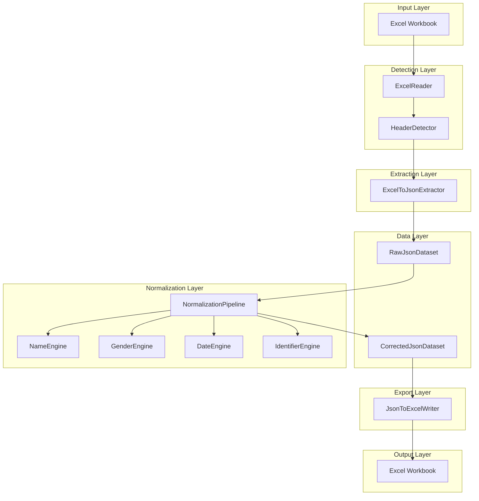

# Design Document: JSON-Based Excel Data Normalization Pipeline

## Overview

This document defines the design for a JSON-based data normalization pipeline that processes Excel worksheets with varying structures. The system detects headers, extracts data to JSON format, applies normalization engines, and produces both raw and corrected JSON datasets that can be exported back to Excel.

### Core Design Principle

The system uses JSON as the internal data representation to decouple Excel file complexity from normalization logic. This approach provides:
- **Resilience**: Excel formatting issues (merged cells, multi-row headers) are handled once during extraction
- **Testability**: Normalization engines operate on simple JSON structures
- **Maintainability**: Clear separation between IO and business logic
- **Flexibility**: Easy to add new data sources or output formats

### Key Characteristics

- **JSON-centric**: All processing operates on JSON row dictionaries
- **Non-destructive**: Original values are preserved alongside corrected values
- **Engine-agnostic**: Existing normalization engines work without modification
- **Multi-sheet support**: Each worksheet produces its own JSON dataset
- **Bidirectional**: Supports both Excel → JSON and JSON → Excel workflows

## Architecture

### Architectural Principles

1. **Separation of Concerns**: IO, extraction, normalization, and export are separate components
2. **Immutability**: Original data is never modified; corrections are stored separately
3. **Engine Compatibility**: Existing engines operate on JSON values without changes
4. **Clean Interfaces**: Each component has well-defined inputs and outputs
5. **Error Isolation**: Failures in one worksheet don't affect others

### System Architecture Diagram



### Processing Pipeline

```
1. Excel Workbook
   ↓
2. ExcelReader (detect headers, identify columns)
   ↓
3. ExcelToJsonExtractor (convert rows to JSON)
   ↓
4. RawJsonDataset (original values)
   ↓
5. NormalizationPipeline (apply engines)
   ↓
6. CorrectedJsonDataset (original + corrected values)
   ↓
7. JsonToExcelWriter (export to Excel)
   ↓
8. Output Excel Workbook
```

## Components and Interfaces

### 1. ExcelReader

**Responsibility**: Read Excel files and detect header structure (EXISTING COMPONENT - REUSED)

**Key Methods**:
```python
def detect_columns(self, worksheet: Worksheet) -> Dict[str, ColumnHeaderInfo]:
    """
    Detect all relevant columns in the worksheet.
    Returns mapping of field names to column information.
    """

def detect_table_region(self, worksheet: Worksheet) -> Optional[TableRegion]:
    """
    Detect the table region including header rows and data boundaries.
    """
```

**Dependencies**: openpyxl, HeaderDetector (internal)

### 2. ExcelToJsonExtractor

**Responsibility**: Extract data rows from Excel and convert to JSON format

**Key Methods**:
```python
def extract_sheet_to_json(self, worksheet: Worksheet, 
                          column_mapping: Dict[str, ColumnHeaderInfo],
                          table_region: TableRegion) -> SheetDataset:
    """
    Extract all data rows from worksheet and convert to JSON format.
    
    Args:
        worksheet: The worksheet to extract from
        column_mapping: Field name to column mapping
        table_region: Table boundaries and header information
    
    Returns:
        SheetDataset with raw JSON rows and metadata
    """

def extract_row_to_json(self, worksheet: Worksheet, row_num: int,
                        column_mapping: Dict[str, ColumnHeaderInfo]) -> JsonRow:
    """
    Extract a single row and convert to JSON dictionary.
    
    Args:
        worksheet: The worksheet
        row_num: Row number to extract
        column_mapping: Field name to column mapping
    
    Returns:
        Dictionary with field names as keys and cell values as values
    """

def extract_workbook_to_json(self, workbook_path: str) -> WorkbookDataset:
    """
    Extract all worksheets from a workbook to JSON format.
    
    Args:
        workbook_path: Path to Excel file
    
    Returns:
        WorkbookDataset containing all sheet datasets
    """
```

**Dependencies**: ExcelReader, openpyxl

### 3. NormalizationPipeline

**Responsibility**: Apply normalization engines to JSON rows

**Key Methods**:
```python
def normalize_dataset(self, raw_dataset: SheetDataset) -> SheetDataset:
    """
    Apply normalization engines to all rows in dataset.
    
    Args:
        raw_dataset: SheetDataset with original values
    
    Returns:
        SheetDataset with both original and corrected values
    """

def normalize_row(self, json_row: JsonRow) -> JsonRow:
    """
    Apply normalization engines to a single row.
    Creates corrected fields for each normalized value.
    
    Args:
        json_row: Dictionary with original field values
    
    Returns:
        Dictionary with original and corrected field values
    """

def apply_name_normalization(self, json_row: JsonRow) -> None:
    """
    Apply NameEngine to name fields in the row.
    Updates json_row with corrected fields.
    """

def apply_gender_normalization(self, json_row: JsonRow) -> None:
    """
    Apply GenderEngine to gender field in the row.
    Updates json_row with corrected field.
    """

def apply_date_normalization(self, json_row: JsonRow) -> None:
    """
    Apply DateEngine to date fields in the row.
    Updates json_row with corrected fields.
    """

def apply_identifier_normalization(self, json_row: JsonRow) -> None:
    """
    Apply IdentifierEngine to identifier fields in the row.
    Updates json_row with corrected fields.
    """
```

**Dependencies**: NameEngine, GenderEngine, DateEngine, IdentifierEngine

### 4. JsonToExcelWriter

**Responsibility**: Export JSON datasets back to Excel format

**Key Methods**:
```python
def write_dataset_to_excel(self, dataset: SheetDataset, 
                           output_path: str) -> None:
    """
    Write a single sheet dataset to Excel file.
    
    Args:
        dataset: SheetDataset with corrected values
        output_path: Path for output Excel file
    """

def write_workbook_to_excel(self, workbook_dataset: WorkbookDataset,
                            output_path: str) -> None:
    """
    Write multiple sheet datasets to Excel workbook.
    
    Args:
        workbook_dataset: WorkbookDataset with all sheets
        output_path: Path for output Excel file
    """

def create_header_row(self, worksheet: Worksheet, 
                      field_names: List[str]) -> None:
    """
    Create header row with original and corrected column names.
    
    Args:
        worksheet: Worksheet to write to
        field_names: List of field names from JSON
    """

def write_json_row(self, worksheet: Worksheet, row_num: int,
                   json_row: JsonRow, field_names: List[str]) -> None:
    """
    Write a single JSON row to Excel worksheet.
    
    Args:
        worksheet: Worksheet to write to
        row_num: Row number to write to
        json_row: Dictionary with field values
        field_names: Ordered list of field names
    """
```

**Dependencies**: openpyxl

## Data Models

### JsonRow

```python
JsonRow = Dict[str, Any]

# Example structure:
{
    "first_name": "יוסי",
    "first_name_corrected": "יוסי",
    "last_name": "כהן",
    "last_name_corrected": "כהן",
    "father_name": "דוד",
    "father_name_corrected": "דוד",
    "gender": "ז",
    "gender_corrected": "2",
    "id_number": "123456789",
    "id_number_corrected": "123456789",
    "birth_year": 1980,
    "birth_year_corrected": 1980,
    "birth_month": 5,
    "birth_month_corrected": 5,
    "birth_day": 15,
    "birth_day_corrected": 15
}
```

### SheetDataset

```python
@dataclass
class SheetDataset:
    """Dataset for a single worksheet."""
    sheet_name: str                    # Name of the worksheet
    header_row: int                    # Row number where headers were found
    header_rows_count: int             # Number of header rows (1 or 2)
    field_names: List[str]             # List of detected field names
    rows: List[JsonRow]                # List of JSON row dictionaries
    metadata: Dict[str, Any]           # Additional metadata
    
    # Example metadata:
    # {
    #     "source_file": "data.xlsx",
    #     "extraction_date": "2024-01-15",
    #     "total_rows": 100,
    #     "date_field_structure": {
    #         "birth_date": "split",
    #         "entry_date": "single"
    #     }
    # }
```

### WorkbookDataset

```python
@dataclass
class WorkbookDataset:
    """Dataset for an entire workbook."""
    source_file: str                   # Path to source Excel file
    sheets: List[SheetDataset]         # List of sheet datasets
    metadata: Dict[str, Any]           # Workbook-level metadata
    
    # Example metadata:
    # {
    #     "extraction_date": "2024-01-15",
    #     "total_sheets": 3,
    #     "processed_sheets": 2,
    #     "skipped_sheets": ["Summary"]
    # }
```

### ColumnHeaderInfo (EXISTING - REUSED)

```python
@dataclass
class ColumnHeaderInfo:
    """Information about a detected column."""
    col: int                           # Column index (1-based)
    header_row: int                    # Row where header was found
    last_row: int                      # Last row with data
    header_text: str                   # Original header text
```

### TableRegion (EXISTING - REUSED)

```python
@dataclass
class TableRegion:
    """Information about table boundaries."""
    start_row: int                     # First row of table (header row)
    end_row: int                       # Last row with data
    start_col: int                     # First column
    end_col: int                       # Last column
    header_rows: int                   # Number of header rows (1 or 2)
    data_start_row: int                # First row of data (after headers)
```

## JSON Schema

### Sheet Dataset Schema

```json
{
  "$schema": "http://json-schema.org/draft-07/schema#",
  "type": "object",
  "properties": {
    "sheet_name": {"type": "string"},
    "header_row": {"type": "integer"},
    "header_rows_count": {"type": "integer", "enum": [1, 2]},
    "field_names": {
      "type": "array",
      "items": {"type": "string"}
    },
    "rows": {
      "type": "array",
      "items": {
        "type": "object",
        "patternProperties": {
          "^[a-z_]+$": {},
          "^[a-z_]+_corrected$": {}
        }
      }
    },
    "metadata": {"type": "object"}
  },
  "required": ["sheet_name", "header_row", "field_names", "rows"]
}
```

### Row Schema Example

```json
{
  "type": "object",
  "properties": {
    "first_name": {"type": ["string", "null"]},
    "first_name_corrected": {"type": ["string", "null"]},
    "last_name": {"type": ["string", "null"]},
    "last_name_corrected": {"type": ["string", "null"]},
    "father_name": {"type": ["string", "null"]},
    "father_name_corrected": {"type": ["string", "null"]},
    "gender": {"type": ["string", "number", "null"]},
    "gender_corrected": {"type": ["string", "number", "null"]},
    "id_number": {"type": ["string", "null"]},
    "id_number_corrected": {"type": ["string", "null"]},
    "passport": {"type": ["string", "null"]},
    "passport_corrected": {"type": ["string", "null"]},
    "birth_date": {"type": ["string", "null"]},
    "birth_date_corrected": {"type": ["string", "null"]},
    "birth_year": {"type": ["integer", "null"]},
    "birth_year_corrected": {"type": ["integer", "null"]},
    "birth_month": {"type": ["integer", "null"]},
    "birth_month_corrected": {"type": ["integer", "null"]},
    "birth_day": {"type": ["integer", "null"]},
    "birth_day_corrected": {"type": ["integer", "null"]},
    "entry_date": {"type": ["string", "null"]},
    "entry_date_corrected": {"type": ["string", "null"]},
    "entry_year": {"type": ["integer", "null"]},
    "entry_year_corrected": {"type": ["integer", "null"]},
    "entry_month": {"type": ["integer", "null"]},
    "entry_month_corrected": {"type": ["integer", "null"]},
    "entry_day": {"type": ["integer", "null"]},
    "entry_day_corrected": {"type": ["integer", "null"]}
  }
}
```

## Algorithms

### Excel to JSON Extraction Algorithm

```
Input: Excel worksheet, column mapping, table region

1. Initialize empty list for JSON rows

2. For each row from data_start_row to end_row:
   a. Create empty JSON row dictionary
   b. For each field in column mapping:
      - Get column index from mapping
      - Read cell value from worksheet
      - Store value in JSON row with field name as key
      - Initialize corrected field with None
   c. Add JSON row to list

3. Create SheetDataset with:
   - Sheet name
   - Header row information
   - Field names list
   - JSON rows list
   - Metadata

4. Return SheetDataset

Output: SheetDataset with raw JSON rows
```

### Normalization Pipeline Algorithm

```
Input: SheetDataset with raw values

1. Create copy of dataset for corrected values

2. For each JSON row in dataset:
   a. Apply name normalization:
      - If first_name exists, normalize and store in first_name_corrected
      - If last_name exists, normalize and store in last_name_corrected
      - If father_name exists, normalize and store in father_name_corrected
   
   b. Apply gender normalization:
      - If gender exists, normalize and store in gender_corrected
   
   c. Apply date normalization:
      - If birth_date exists (single field), normalize and store in birth_date_corrected
      - If birth_year/month/day exist (split fields), normalize and store in corrected fields
      - Same for entry_date fields
   
   d. Apply identifier normalization:
      - If id_number exists, normalize and store in id_number_corrected
      - If passport exists, normalize and store in passport_corrected

3. Return corrected dataset

Output: SheetDataset with original and corrected values
```

### JSON to Excel Export Algorithm

```
Input: SheetDataset with corrected values, output path

1. Create new Excel workbook

2. Create worksheet with sheet name

3. Write header row:
   a. For each field name in dataset:
      - Write original field name in column N
      - Write corrected field name (field_name_corrected) in column N+1
   
4. For each JSON row in dataset:
   a. For each field name:
      - Write original value to column N
      - Write corrected value to column N+1
   b. Increment row number

5. Save workbook to output path

Output: Excel file with original and corrected columns
```

### Multi-Row Header Handling

```
When extracting data with multi-row headers:

1. Detect if headers span 2 rows (from TableRegion)

2. If single row header:
   - Use field names directly from column mapping
   - Extract data starting from row after header

3. If two-row header:
   - Primary header is in first row (parent headers)
   - Sub-header is in second row (child headers like year/month/day)
   - Use field names from column mapping (already resolved)
   - Extract data starting from row after both headers

4. Field naming for split dates:
   - birth_year, birth_month, birth_day (not birth_date)
   - entry_year, entry_month, entry_day (not entry_date)

5. Store header_rows_count in metadata for reference
```

## Engine Integration

### Existing Engines (NO CHANGES REQUIRED)

The existing normalization engines continue to work without modification:

**NameEngine**:
```python
def normalize_name(self, name: str) -> str:
    """Normalize a name string."""
    # Existing implementation unchanged
```

**GenderEngine**:
```python
def normalize_gender(self, gender: str) -> str:
    """Normalize gender value to standard code."""
    # Existing implementation unchanged
```

**DateEngine**:
```python
def normalize_date(self, year: int, month: int, day: int) -> str:
    """Normalize date components to standard format."""
    # Existing implementation unchanged
```

**IdentifierEngine**:
```python
def normalize_id(self, id_value: str) -> str:
    """Normalize identifier value."""
    # Existing implementation unchanged
```

### Engine Adapter Pattern

The NormalizationPipeline acts as an adapter between JSON rows and engines:

```python
def apply_name_normalization(self, json_row: JsonRow) -> None:
    """Apply NameEngine to name fields."""
    name_engine = NameEngine()
    
    if "first_name" in json_row:
        original = json_row["first_name"]
        if original:
            corrected = name_engine.normalize_name(str(original))
            json_row["first_name_corrected"] = corrected
        else:
            json_row["first_name_corrected"] = original
    
    # Same pattern for last_name and father_name
```

This adapter pattern:
- Extracts values from JSON
- Converts to engine input format (strings, integers)
- Calls existing engine methods
- Stores results back in JSON with _corrected suffix

## Error Handling

### Extraction Errors

**Missing Headers**:
- Skip worksheet and log warning
- Continue processing other worksheets
- Include skipped sheets in metadata

**Invalid Cell Values**:
- Store None for empty cells
- Convert formulas to calculated values
- Log warnings for formula errors

**Merged Cell Issues**:
- Extract value from top-left cell of merged range
- Log info about merged cells encountered

### Normalization Errors

**Engine Failures**:
- If engine raises exception, store original value in corrected field
- Log error with row number and field name
- Continue processing other fields and rows

**Missing Fields**:
- Skip normalization for fields not in column mapping
- Don't create corrected fields for missing fields

**Invalid Values**:
- Pass to engine and let engine handle
- If engine returns None or raises error, use original value

### Export Errors

**File Write Failures**:
- Raise exception with clear error message
- Ensure partial files are not left behind
- Provide path to temporary file if available

**Invalid JSON Structure**:
- Validate dataset before export
- Raise exception if required fields missing
- Log detailed validation errors

## Performance Considerations

### Optimization Strategies

1. **Batch Processing**: Process rows in batches for better memory usage
2. **Lazy Loading**: Load worksheets on demand, not all at once
3. **Parallel Processing**: Process multiple worksheets in parallel (future enhancement)
4. **Memory Management**: Stream large datasets instead of loading all in memory
5. **Caching**: Cache column mappings and header detection results

### Performance Targets

- Extract 1000 rows: < 1 second
- Normalize 1000 rows: < 2 seconds
- Export 1000 rows: < 1 second
- Total pipeline for 1000 rows: < 5 seconds

### Scalability

The JSON-based approach scales well:
- Memory usage proportional to dataset size
- No Excel file kept open during normalization
- Easy to implement streaming for very large files
- Can process worksheets independently

## Testing Strategy

### Unit Tests

**ExcelToJsonExtractor**:
- Test single row extraction
- Test multi-row extraction
- Test handling of empty cells
- Test handling of merged cells
- Test multi-row headers

**NormalizationPipeline**:
- Test each engine integration
- Test corrected field creation
- Test handling of missing fields
- Test error handling

**JsonToExcelWriter**:
- Test header row creation
- Test data row writing
- Test multi-sheet export
- Test file creation

### Integration Tests

**End-to-End Pipeline**:
- Test complete Excel → JSON → Normalize → Excel flow
- Test with real-world Excel files
- Test with multiple worksheets
- Test with various header structures

**Engine Compatibility**:
- Verify existing engines work with JSON values
- Test all field types
- Test edge cases for each engine

### Property-Based Tests

**Property 1: Data Preservation**
```python
@given(json_row())
def test_original_values_preserved(row):
    """Original values must never be modified."""
    original = row.copy()
    normalized = pipeline.normalize_row(row)
    for key in original:
        if not key.endswith("_corrected"):
            assert normalized[key] == original[key]
```

**Property 2: Corrected Field Creation**
```python
@given(json_row())
def test_corrected_fields_created(row):
    """Every field must have a corresponding corrected field."""
    normalized = pipeline.normalize_row(row)
    for key in row:
        if not key.endswith("_corrected"):
            assert f"{key}_corrected" in normalized
```

**Property 3: Round-Trip Consistency**
```python
@given(excel_file())
def test_round_trip_preserves_data(excel_path):
    """Excel → JSON → Excel should preserve original data."""
    dataset = extractor.extract_workbook_to_json(excel_path)
    output_path = "temp_output.xlsx"
    writer.write_workbook_to_excel(dataset, output_path)
    
    # Verify original values match
    original_data = read_excel_data(excel_path)
    output_data = read_excel_data(output_path)
    assert original_data == output_data
```

## Migration Strategy

### Phase 1: Add JSON Components (No Breaking Changes)

1. Add ExcelToJsonExtractor class
2. Add NormalizationPipeline class
3. Add JsonToExcelWriter class
4. Add SheetDataset and WorkbookDataset data models
5. Keep existing code unchanged

### Phase 2: Update Orchestrator

1. Modify orchestrator to use new JSON pipeline
2. Keep old code path as fallback
3. Add feature flag to switch between old and new pipeline

### Phase 3: Deprecate Old Code

1. Remove old direct Excel manipulation code
2. Remove feature flag
3. Update documentation

### Backward Compatibility

- Existing engines require NO changes
- ExcelReader remains unchanged
- Column detection logic remains unchanged
- Only orchestrator needs updates to use new pipeline

